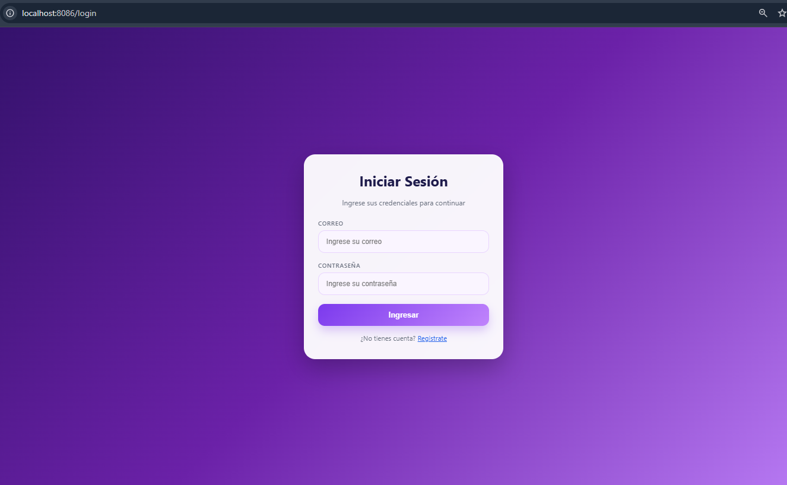
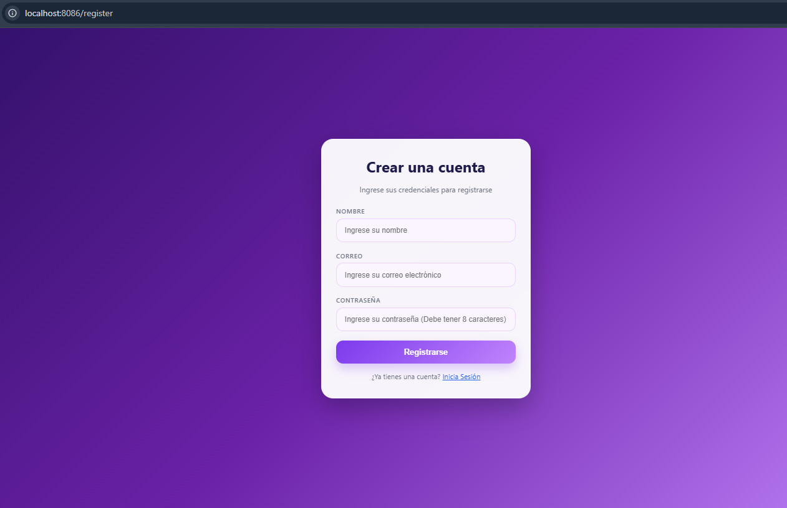
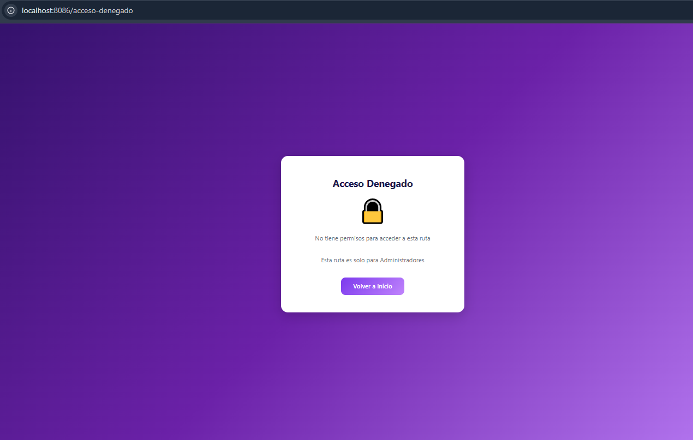
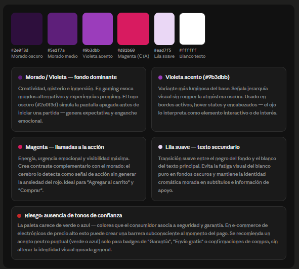

# ACT3B2_KennethCaneda
Actividad 3 de Taller, crud completo con thymeleaf conectando backend con frontend, además de funcionalidades de login y register con protección de rutas

Detalles de esta API:
  -Esta API cuenta con un login y un register, por lo que no se podrán acceder a las demás rutas si no se ha accedido o creado una cuenta para acceder
      Cómo se vería el Login:
      
      Cómo se vería el register:
      
Rutas Protegidas por Roles de esta API:
  -Esta API tiene rutas a las que solo pueden acceder usuarios con roles específicos
     Rutas Protegidas: (Solo pueden acceder usuarios con el rol "ADMIN")
       *localhost:8086/usuarios
       *localhost:8086/clientes

  -Al intentar acceder a una de estas rutas siendo un usuario normal, se le redirigirá a una página de acceso denegado:
     Cómo debería verse la página de acceso denegado:
     
  
Paleta de colores:

